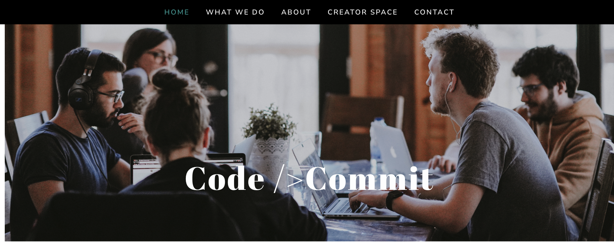

# Code Commit 


## Website can be viewed here:
https://code-commit.netlify.app/

## Website 
Website created for a coding group/meetup.

Includes About Section:


Join our community:


Page which includes navigation between the different information sections. 
Navigation bar provides option to link to external pages
The join us form allows visitors to register their interest in joining the community

* Form to be linked to MongoDB to store user input

## Installation Options

To install the project dependencies, execute the following:
```jsx
npm install
or
yarn install
```

### Credits

All images, available for public use, were sourced from unsplash.com. This project does not claim any ownership or credit over the images. The images are available here:

Image 1: (head.jpg):
Annie Spratt
https://unsplash.com/photos/hCb3lIB8L8E

Image 2: (inspire.jpg)
Leon: @myleon
https://unsplash.com/photos/fznQW-kn5VU

Creator Space images:
myHQ Workspaces
https://unsplash.com/@myhq
